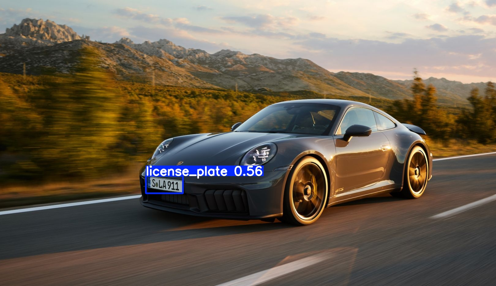

# 🚗 License Plate Recognition System using YOLO & OCR

This project implements a **License Plate Recognition System** using **YOLO (You Only Look Once)** for real-time license plate detection and **Easy OCR** for extracting the license number from detected plates.

## Overview

The system performs the following steps:

1. Detects license plates in images using a pre-trained YOLO model.
2. Extracts the plate region and applies image processing for better OCR results.
3. Uses Easy OCR to read and recognize the text on the license plate.

## Technologies Used

- **YOLO** – For license plate detection
- **OpenCV** – For image processing
- **EasyOcr** – For Optical Character Recognition
- **Python** – Programming language

## How to Run

- Run the `plate.ipynb` notebook step-by-step.
- Upload test images to the `images/` folder or Colab cell.
- Results will be displayed and saved to the `outputs/` folder.

## Results

The system draws bounding boxes around detected license plates and displays the recognized text, saving annotated images and logs.

